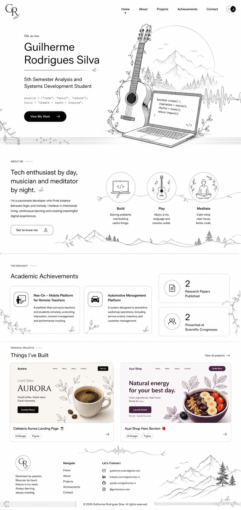

# 🎨 Minimalist Portfolio Website

A modern, minimalist portfolio website designed to showcase my work, academic achievements, and personal projects.

This project was created with a strong focus on **clean UI/UX**, **responsive design**, and **visual storytelling**, combining technology with inspirations from **music** and **nature**.

---

## 📸 Preview



---

## ✨ Features

- Responsive design
- Modern minimalist interface
- Monochromatic (Black & White) visual identity
- Custom fine-line illustrations
- Smooth and organized layout
- Academic achievements section
- Personal projects showcase
- Call-to-action Hero section

---

## 🛠️ Built With

- HTML5
- CSS3
- JavaScript
- Flexbox
- CSS Grid

---

## 📚 Sections

- Hero
- About Me
- Academic Achievements
- Personal Projects
- Contact

---

## 🏆 Academic Highlights

- 📄 2 Research Papers Published
- 🎤 Presented at 2 Scientific Congresses

### Featured Academic Projects

- **Nex-On** — Mobile Platform for Remote Teachers
- **Automotive Management Platform**

---

## 💻 Featured Personal Projects

- ☕ Cafeteria Aurora Landing Page
- 🍓 Açaí Shop Hero Section

---

## 🎯 Design Concept

The portfolio embraces a **minimalist black-and-white aesthetic**, emphasizing clarity, whitespace, and elegant typography.

The handcrafted illustrations are inspired by:

- 🎸 Music
- 🌿 Nature
- 💻 Software Development
- 🧘 Mindfulness

Together, these elements create a calm and organized visual identity while reflecting both my technical and creative interests.

---

## 📱 Responsive Design

The interface was designed to provide a consistent experience across desktops, tablets, and mobile devices.

---

## 📂 Project Structure

```text
.
├── preview/
│   └── site.png
├── assets/
│   ├── images/
│   ├── icons/
│   └── illustrations/
├── css/
├── js/
├── index.html
└── README.md
```

---

## 👨‍💻 Author

**Guilherme Rodrigues Silva**

- GitHub: https://github.com/guilhermerodrigu3s
- LinkedIn: https://www.linkedin.com/in/guilherme-rodrigues-silva-33705926a

---

If you enjoyed this project, consider giving it a ⭐ on GitHub.
